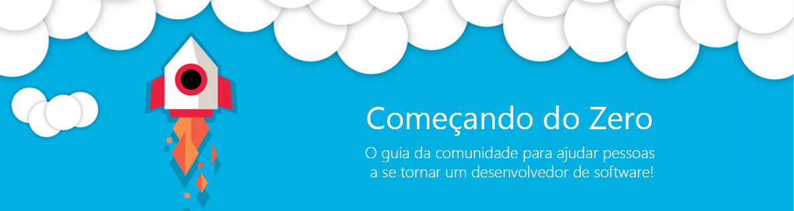

# Começando do Zero

> O guia da comunidade técnica para ajudar pessoas a se tornarem um desenvolvedor de software

**Já parou pra pensar quantas tecnologias você precisa saber para se tornar um desenvolvedor de software?** O primeiro passo pode ser mais difícil do que imaginamos, é uma avalanche de informação que impede a pessoa de avançe e obtenha foco no que realmente é preciso naquele momento inicial.

Com base nisso, criei este repositório em 2014 logo após de [escrever um post](http://www.rodrigokono.net/oportunidade/comeando-do-zero-quais-tecnologias-preciso-aprender-hoje-e-porque/) que repercurtiu bastante e chamei carinhosamente de **Começando do Zero**. Em 2016, no saudoso aspnet{cast}, gravamos uma live falando um pouco mais sobre este assunto. [Vale a pena assistir](https://www.youtube.com/watch?v=B796oCWkkRw). Tivemos muitos e ótimos feedbacks neste video.

> Hoje, em 2019, gostaria de te convidar para continuar este projeto junto comigo até que ele ande sozinho e tome vida própria. Pode parecer utopia, mas acredito que isto é também uma forma de eu agradecer todos que me ajudaram até aqui. 

## Como Participar

Se você é especialista em alguma área do desenvolvimento de software, você pode contribuir ajudando a criar, definir e manter o conteúdo.

Mas você também pode ajudar caso você tenha boas condições de desenvolver a landing page, ou de criar a UX/UI ou mesmo de traduzir o conteúdo para outro idioma diferente do `pt-br`.

  #### 💡 Qual o plano? 
  Tornar simples o que parece ser complexo. Toda a colaboração deve ser realizada em markdown e versionadas no github. Ao mesmo tempo teremos uma landing page que irá ler os dados diretamente do repositório. 
  
  Um projeto que admiramos é o [Projeto Browser Diet](https://browserdiet.com/) criado pelo Zeno Rocha, que possui a mesma estratégia de colaboração.
  
  #### 🔀 Ramificações do Guia 
  - Por áreas do desenvolvimento de software
    - Backend, frontend, Mobile, Cloud, database, Ferramental, etc.
      - Por linguagens de programação (especialidade - .NET, NodeJS, Java, React, Angular, Flutter, etc)        
  - Por Conceitos
    - Básico de Programação, OOP, Princípios SOLID, etc.

  #### 🚨 Considerações Importantes 
  - Este guia é para pessoas iniciantes.
  - A ideia é simplificar. O menos é mais. Sabemos que isto pode se tornar extenso, cansativo e não é isso que queremos.  
  - Temos um [canal no Telegram](https://t.me/comecandodozero) para colaboração durante a criação deste guia. Toda ajuda é bem vinda.

## Time

#### Criador
 |
--- |
[Rodrigo Kono](https://github.com/rodrigokono) MVP Microsoft |

#### Design

> free slot

#### Desenvolvedores

> free slot

#### Autores

> free slot

#### Tradutores

> free slot

## Licença

Código está sob licença [MIT](https://rodrigokono.mit-license.org/) e o conteúdo está sob [Creative Commons BY-SA 3.0](https://creativecommons.org/licenses/by-sa/3.0/deed.pt_BR)